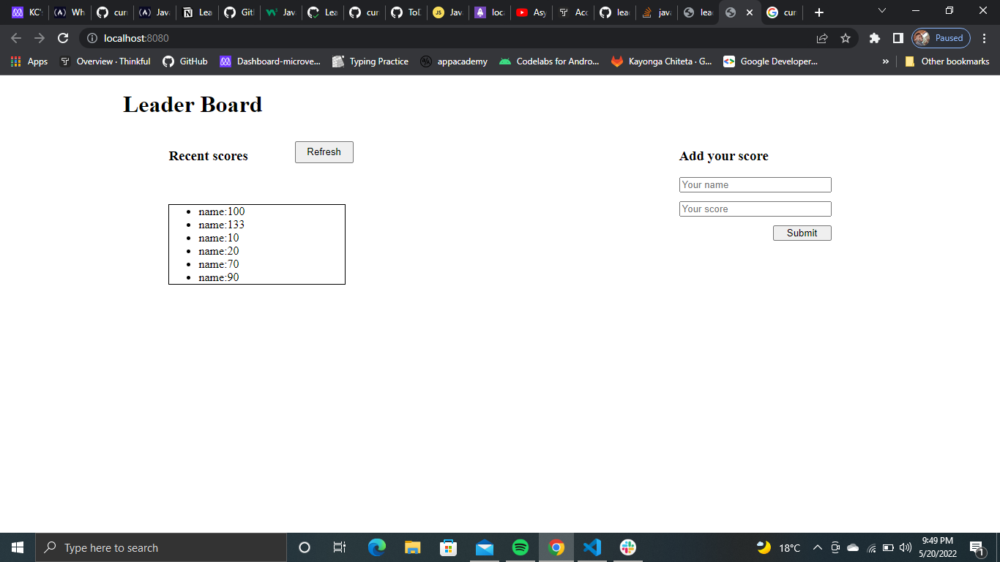
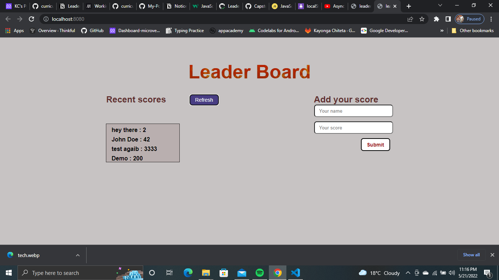

# Leaderboard: final touches





> Everything you need to start using webpack is all setup and ready to use just run the following commands to get started:

Get started by copying and pasting the following in your terminal: 

- 1 
```
git@github.com:Kayonga99/leaderboard-app.git
```
- 2

```
cd leaderboard-app
```

- 3
```
npm install
```

- 4

 This will generate a dist folder you never edit what is in there.
```
npm run build
```


- 5

```
npm start
```
The browser will open and you should see this text : "Hello webpack!", if this is not the case please stay calm and simply open your browser and paste this.
```
http://localhost:3000
```


- 6

## Live demo 

[Click here to see web](https://effervescent-strudel-50d587.netlify.app)

## Buit with
- Javascript
- Webpack
- CSS

## Author
 
 👤 **Kayonga Chiteta**

- GitHub: [@Kayonga99](https://github.com/Kayonga99)
- Twitter: [@KayongaChiteta3](https://twitter.com/KayongaChiteta3?t=gfILCjmltzGRZOx6FZ8-nQ&s=08)
- LinkedIn: [Kkayonga Chiteta](https://www.linkedin.com/in/kayonga-chiteta-776949227)

 You can start editing the files in the "src" folder

## Happy coding! 🌈

if you are interested in learning more about webpack click the link below

[click here!](https://webpack.js.org/guides/getting-started/)

## Show your support

Give a ⭐️ if you like this project!

## Acknowledgments

- Hat tip to anyone whose code was used
- Inspiration
- etc

## 📝 License

This project is [MIT](./MIT.md) licensed.
